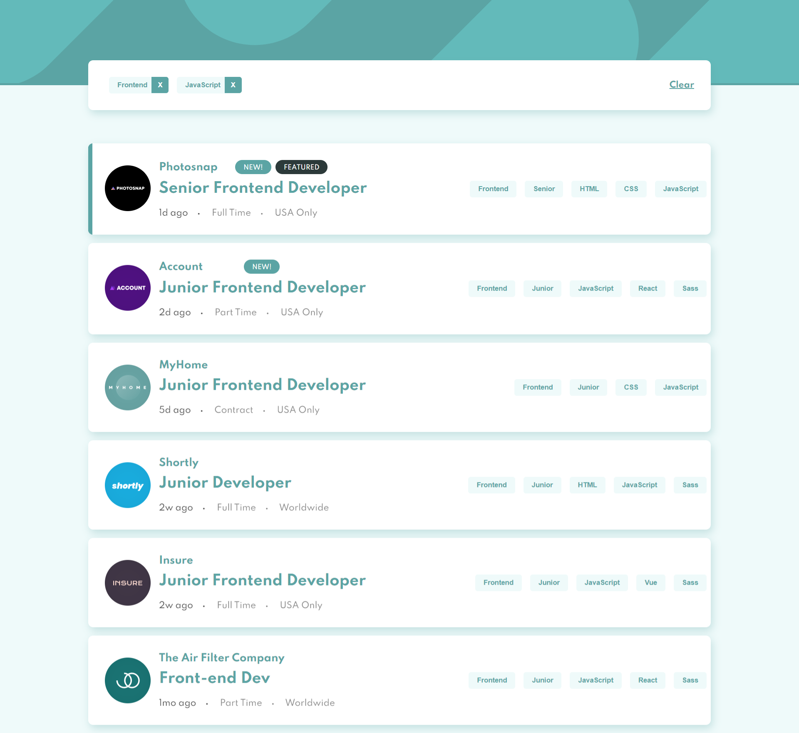

# Frontend Mentor - Job listings with filtering solution

This is a solution to the [Job listings with filtering challenge on Frontend Mentor](https://www.frontendmentor.io/challenges/job-listings-with-filtering-ivstIPCt). Frontend Mentor challenges help you improve your coding skills by building realistic projects. 

## Table of contents

- [Overview](#overview)
  - [The challenge](#Job listings with filtering)
  - [Screenshot](#screenshot)
  - [Links](#links)
- [My process](#my-process)
  - [Built with](#HTML, javascript, sass)
  - [What I learned](#grid, flexbox, how to filter an array of objects by another array)
  - [Continued development](#continued-development)
  - [Useful resources](#https://fonts.google.com/specimen/Spartan)
- [Author](#ziqing wang)


## Overview

### The challenge

Users should be able to:

- View the optimal layout for the site depending on their device's screen size
- See hover states for all interactive elements on the page
- Filter job listings based on the categories

### Screenshot




### Links

- Solution URL: [https://github.com/ziqing-wang/job-listings/](https://your-solution-url.com)
- Live Site URL: [https://job-listings-zi.netlify.app/](https://your-live-site-url.com)

## My process

### Built with

- Semantic HTML5 markup
- CSS custom properties
- Flexbox
- CSS Grid
- SASS
- Javascript ES6


### What I learned

```js - filter listings

const controlFilter = (filterValue) => {
    if (!filterValue || model.state.filters.includes(filterValue)) return;
    // Update the filters
    model.state.filters.push(filterValue);

    if (model.state.filtered === undefined) model.state.filtered = model.state.jobs;

    // Filter the jobs
    model.state.filtered = model.state.filtered.filter(el => el.tags.includes(filterValue));;
    // Render filters container
    filterView.render(model.state.filters);

    // Render filtered jobs
    jobView.render(model.state.filtered);
}

const controlRemoveFilter = (tag) => {
    if (!tag) return;
    model.state.filters.pop(tag);
    const filters = model.state.filters;
 
    if (filters.length === 0) controlClearFilters();

    const [filteredJobs] = filters.map(fl => model.state.jobs.filter(job =>job.tags.includes(fl)))

    model.state.filtered = filteredJobs;
    // Render filters container
    filterView.render(model.state.filters);

    // Render filtered jobs
    jobView.render(model.state.filtered);
}
```


